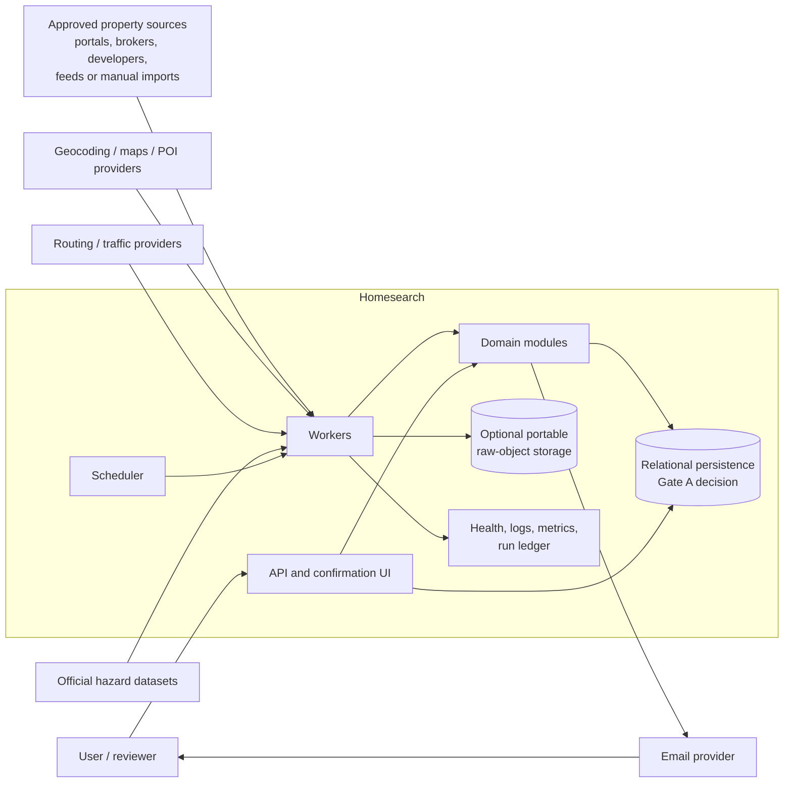

# Homesearch Architecture

## Target shape

Homesearch is a low-cost, auditable **modular monolith with separately runnable web, scheduler, and worker entry points**, a relational persistence strategy selected at Gate A, and optional provider-neutral object storage.

Modules share one versioned codebase but communicate through explicit application interfaces and durable jobs/events. This avoids premature distributed-system complexity while leaving clean seams for measured future extraction.

This is a target architecture, not approval to begin Phase 1.

PostgreSQL is the likely long-term production target, especially if PostGIS provides material geospatial value. Phase 0 does not decide the local-development store, early/MVP persistence, production relational target, or migration path.

## Adopted directions

- Separate physical properties, listings, and immutable observations.
- Persist permitted source evidence before or atomically with downstream scheduling.
- Make parsing, normalization, identity, merge, enrichment, evaluation, and change detection versioned/replayable.
- Use append-oriented history plus rebuildable current projections.
- Keep field candidates/provenance separate from selected canonical state.
- Use durable runs, jobs, and events for audit, retries, idempotency, and notification deduplication.
- Isolate every source and external provider behind typed interfaces.
- Preserve explicit unknown/conflict/verification states.
- Run discovery and tracking as distinct workflows sharing ingestion.
- Cache stable enrichment by input fingerprint and refresh policy.
- Bound new-property enrichment with a versioned, deadline-aware notification-readiness policy.

## Gate A proposals

The [Gate A ADR set](adr/README.md) recommends the following. Every item remains `Proposed`; none authorizes implementation:

- [ADR 0001](adr/0001-python-runtime-and-toolchain.md) proposes Python 3.14 with a synchronous application and adapter baseline.
- [ADRs 0002–0003](adr/0002-database-strategy.md) propose PostgreSQL 18 throughout, SQLAlchemy 2/psycopg 3, Alembic, UUIDv7, and UTC-aware system instants.
- [ADR 0005](adr/0005-scheduling-and-durable-jobs.md) proposes no Phase 1 scheduler/job engine and PostgreSQL-backed durable jobs only from Phase 6.
- [ADR 0006](adr/0006-web-and-api.md) proposes no early server and FastAPI only when an approved HTTP surface is needed.
- [ADR 0008](adr/0008-raw-observation-storage.md) proposes relational metadata plus optional checksum-addressed portable blobs from Phase 2.

See [Quality constraints and open decisions](product/quality-and-decisions.md) and [Roadmap](roadmap.md).

## System context



A source can be an API, feed, permitted HTTP adapter, imported file, or manual input. The diagram does not authorize automated access.

## Module ownership

```text
homesearch/
  domain/
    properties/ listings/ identity/ provenance/
    evaluation/ tracking/ events/
  application/
    discovery/ observation_ingestion/ parsing/
    canonicalization/ enrichment/ notification/
    review/ reporting/
  adapters/
    sources/ database/ object_storage/
    geocoding/ amenities/ routing/ hazards/ email/
  workers/ api/ config/ observability/
```

- **Properties/listings:** domain identities, statuses, value types, and invariants.
- **Identity:** evidence comparison, conflicts, match decisions, and manual-resolution semantics.
- **Provenance:** candidate values, field-specific selection, verification, and conflicts.
- **Evaluation:** profiles, hard rules, preferences, evidence requirements, and explainable outcomes.
- **Tracking/events:** user transitions, semantic change identity, and notification eligibility.
- **Discovery/ingestion/parsing:** approved collection orchestration, immutable capture, and source facts.
- **Canonicalization:** normalization, identity coordination, candidate creation, merge, and projection.
- **Enrichment:** provider calls, cache/staleness, evidence, and versioning.
- **Notification:** versioned readiness/deadline decisions, immutable payloads, delivery attempts, and secure actions.
- **Review/reporting:** audited correction and reproducible output.
- **Adapters:** translation to sources, persistence, storage, enrichment, email, clocks, and IDs.

Domain modules do not fetch pages, call vendors, or depend on ORM models. Source parsers do not own global retries, scheduling, canonical merge, or database transactions.

## Focused architecture documents

- [Pipeline and interfaces](architecture/pipeline-and-interfaces.md) — adapter contracts, discovery/tracking/reprocessing flows, observations, and canonical projections.
- [Jobs and operations](architecture/jobs-and-operations.md) — durable scheduling, idempotency, failure handling, observability, configuration, and testing.
- [Deployment and providers](architecture/deployment-and-providers.md) — action endpoint, topology, portability, backup/recovery, provider strategy, scaling, and risks.
