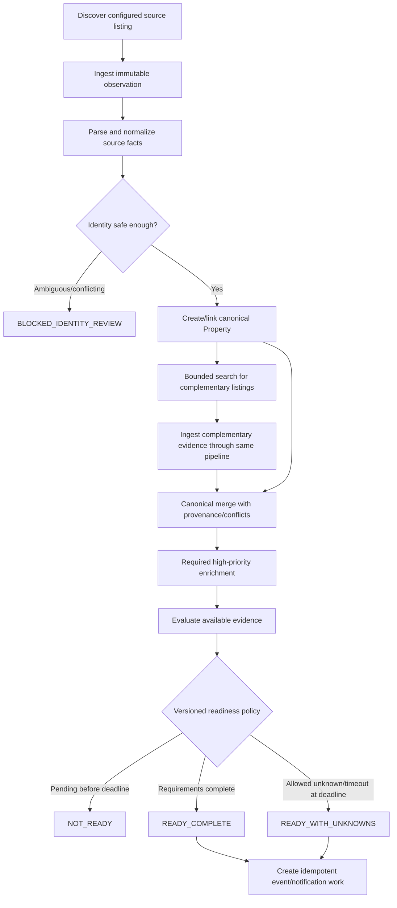

# Pipeline and Interfaces

Read with [Architecture](../architecture.md), [Source requirements](../product/source-and-ingestion.md), and the relevant [data-model](../data-model.md) document.

## Principal interfaces

### Source adapter

- `capabilities()` — discovery/detail/API/feed/manual/status/payload abilities.
- `validate_search(search_spec)` — unsupported criteria explicitly reported.
- `discover(search_spec, cursor)` — listing references and pagination/cursor state.
- `fetch_listing(reference, fetch_policy)` — fetch metadata plus permitted raw/transient payload.
- `parse(observation_payload, parser_version)` — source facts or structured failure.
- `interpret_status(source_facts)` — status evidence, not unsupported property certainty.

Rate/compliance settings are injected per source. Search criteria are neutral domain configuration mapped by each adapter.

### Enrichment provider

Each geocoding, POI, routing/traffic, hazard, terrain, or image provider:

- accepts a typed evidence/input and capability;
- returns provider/dataset version, checked time, confidence/precision, permitted evidence, normalized candidates, expiry, and failure category;
- supports deterministic cache keys independent of internal database IDs; and
- declares license/retention/display constraints.

Separate interfaces are required because freshness, evidence, and licensing semantics differ.

### Notification provider

- Accept immutable rendered payload and idempotency key.
- Return provider reference and acceptance result.
- Optionally map delivery webhooks.
- Never decide whether a change is meaningful.

### Persistence

Repositories express domain/application needs without leaking ORM objects. Multi-step operations use explicit transactions. Store-specific optimizations remain inside adapters and cannot become domain requirements. The schema and persistence contract remain PostgreSQL-compatible/migration-ready even if Gate A permits SQLite for a bounded early/local use.

## New-property discovery and readiness flow

Complementary discovery is source-policy-aware and bounded; its findings re-enter the ordinary observation pipeline. It cannot recursively delay notification forever. Commit each observation before acknowledging downstream work. Reprocessing the same input/version must not duplicate facts, identity decisions, candidates, aggregations, readiness assessments, events, or notifications.

The readiness evaluator consumes a policy version, canonical projection, identity status, evaluation, complementary-listing status, and configured high-priority enrichment outcomes. It schedules re-evaluation when inputs change and a deadline wake-up at the policy's maximum wait.

An optional provider failure becomes an explicit terminal requirement result—such as unknown, not verified, unavailable, or timed out—rather than an indefinitely pending job. The readiness policy decides whether that result permits `READY_WITH_UNKNOWNS`. A deadline never overrides unsafe identity ambiguity.

## Tracking flow

Tracking selects active/possibly active listings for `TRACKING` properties according to:

- configured interval (initially at least twice daily);
- source access/rate rules;
- last successful observation;
- status/confidence;
- retry/backoff state; and
- discovery observations already satisfying freshness.

It reuses observation-to-event processing; it does not create another parser or merge path.

## Reprocessing flow

When a parser, normalizer, identity algorithm, merge policy, or evaluation profile changes:

1. Select affected observations/properties.
2. Create new derived records keyed by input and version.
3. Compare new and current projections.
4. Preserve prior results and supersession links.
5. Emit correction/re-evaluation events only under explicit policy.

Raw evidence is not modified. The system records when replay is impossible because source policy allowed only transient content.

## Manual review flow

1. Create a case containing candidates, evidence, conflicts, and allowed actions.
2. Reviewer selects merge, distinct, split, correction, override, or defer.
3. Record actor, time, rationale, inputs, and affected IDs.
4. Recompute projections and downstream evaluation.
5. Keep observations and earlier automated decisions visible.

## Observation storage

The relational store selected at Gate A retains durable metadata, structured source facts, hashes, compliance/retention class, and provenance. An optional blob adapter stores permitted large payloads. Its logical schema and export path remain migration-ready for the likely PostgreSQL target.

Object metadata includes application-controlled logical key, checksum, size, media type, encoding/compression, storage adapter/key, encryption/lifecycle state, and expiry. Domain code never constructs vendor-specific URLs.

Per-source capture modes:

- full permitted response;
- sanitized/redacted response;
- relevant fragments;
- structured facts only;
- hash/fetch metadata only; or
- transient parse with no retained body.

Body expiry is an audited lifecycle event and does not cascade-delete observation metadata, permitted facts, property history, or notifications. Legal erasure uses a separate procedure.

## Canonical projection

For each field:

1. Collect source, enrichment, and audited-manual candidates.
2. Normalize while preserving raw representations.
3. Apply field-specific authority, freshness, precision, verification, and conflict policy.
4. Select a candidate or explicit unknown/conflicting result.
5. Store policy/version, complete candidate set, and reason.
6. Emit change only when value, confidence, precision, or verification changes materially.

Official sources are not universally authoritative. Current views are rebuildable projections, not the sole record.
