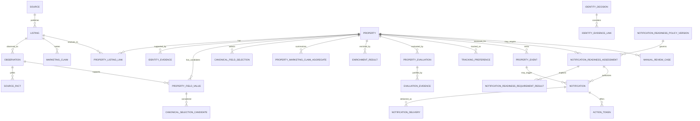

# Homesearch Conceptual Data Model

## Purpose and status

This is the conceptual persistence model, not final SQL. Gate A accepted [database strategy](adr/0002-database-strategy.md) and [database access](adr/0003-database-access-and-migrations.md) decisions selecting PostgreSQL 18, SQLAlchemy/Alembic, UUIDv7, UTC-aware instants, and a tested migration/restore path. Indexes, enum representation, PostGIS, detailed mappings, partitioning, and bitemporal depth remain later schema decisions.

The model must:

- separate properties, listings, and immutable observations;
- preserve source evidence and replay derived processing;
- reconstruct historical state and past knowledge;
- retain field-level provenance/conflicts;
- make identity mistakes reversible;
- distinguish unknown, negative, conflicting, and verified facts;
- version derived results;
- deduplicate jobs, events, and notifications; and
- remain PostgreSQL-compatible/migration-ready without depending on SQLite-specific behavior.

## Modeling conventions

### Identifiers

Every durable entity uses an opaque internal immutable surrogate ID. External IDs, URLs, 建築確認番号, addresses, and hashes are attributes/evidence, never primary keys.

[ADR 0003](adr/0003-database-access-and-migrations.md) selects application-generated UUIDv7 for new durable IDs. UUID order is never a substitute for an explicit recorded time.

### Time

Use UTC instants for system events and preserve raw source date/time plus parsed precision/timezone. Distinguish:

- `observed_at` — Homesearch saw the evidence;
- `source_effective_at` — source says it applied;
- `recorded_at` — committed internally;
- `valid_from`/`valid_to` — confidently modeled domain validity;
- `superseded_at` — derived/selected result ceased being current.

Do not invent time precision.

### Knowledge and verification

Important facts carry:

- typed value;
- `knowledge_state`: `KNOWN`, `UNKNOWN`, `NOT_APPLICABLE`, `CONFLICTING`;
- `verification_status`: `SOURCE_CLAIM`, `NORMALIZED`, `VERIFIED`, `NOT_VERIFIED`, `REJECTED`;
- confidence/precision;
- evidence references and observed/effective times; and
- method/rule version.

A verified `false`/`NO` is a known negative with evidence; it is not null or `UNKNOWN`.

### History

Observations, facts, evidence, events, notification snapshots, and review actions are append-only. Derived records are versioned/superseded. Mutable current projections are rebuildable caches. Legal/compliance erasure is a separate audited lifecycle.

Use typed relational structures for core queryable concepts. Versioned JSON may hold evolving/source-specific details but cannot replace identity, provenance, time, state, or constraints.

## Relationship overview

## Focused entity documents

- [Ingestion model](data-model/ingestion.md) — source/configuration, listing, observation, raw object, parser, source facts, claims.
- [Identity and provenance model](data-model/identity-and-provenance.md) — property linkage, duplicate resolution, merge/split lineage, canonical candidates, price/status history.
- [Enrichment and evaluation model](data-model/enrichment-and-evaluation.md) — address/location, transport, amenities/gym, hazards/terrain, profiles/evidence.
- [Tracking and operations model](data-model/tracking-and-operations.md) — users/tracking, events, notifications/actions, runs/jobs, review, reporting, constraints, portability.

## Cross-model invariants

- No historical evidence is cascade-deleted through an ordinary domain operation.
- Every derived/canonical conclusion identifies inputs and algorithm/policy version.
- A listing normally has at most one active property link, but prior corrected links remain.
- Current selection periods do not overlap per property/field.
- Semantic event, notification, delivery, and token uniqueness are enforced where possible.
- Concurrency, types, constraints, transactions, migrations, and geospatial behavior are validated against the Gate A production target or a PostgreSQL-compatibility path; SQLite-only tests cannot hide differences.
